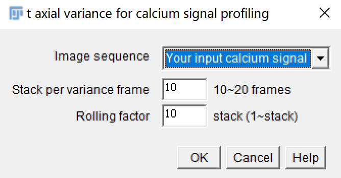

<h1 align="center">t-varianceJ</h1>
<h5 align="center">A simple FIJI/ImageJ plugin for t-axial variance calculation assisting in calcium signal profiling.</h5>
<h5 align="center">It will highlight the regions that have calcium signal transients.</h5>
<h6 align="right">v0.1.3</h6>

 

 

[Portal]() to the plugin.

## Instruction

- Step1: Select calcium image stack that you want to process (first column);
- Step2: Define the number of frames per `variance calculation` (second column);
- Step3: Define the number of frames per `t sliding` (third column).

**For example:**

If `Step2` and `Step2` are defined as `10` and `10`, the variance calculation will act on: `1-10`, `11-20`, `21-30` frames;

If `Step2` and `Step2` are defined as `10` and `1`, the variance calculation will act on: `1-10`, `2-11`, `3-12` frames.

## Open source [tvarianceJ](https://github.com/WeisongZhao/tvarianceJ)
This program is free software: you can redistribute it and/or modify it under the terms of the GNU General Public License as published by the Free Software Foundation, either version 3 of the License, or (at your option) any later version. This program is distributed in the hope that it will be useful, but WITHOUT ANY WARRANTY; without even the implied warranty of MERCHANTABILITY or FITNESS FOR A PARTICULAR PURPOSE. See the GNU General Public License for more details.